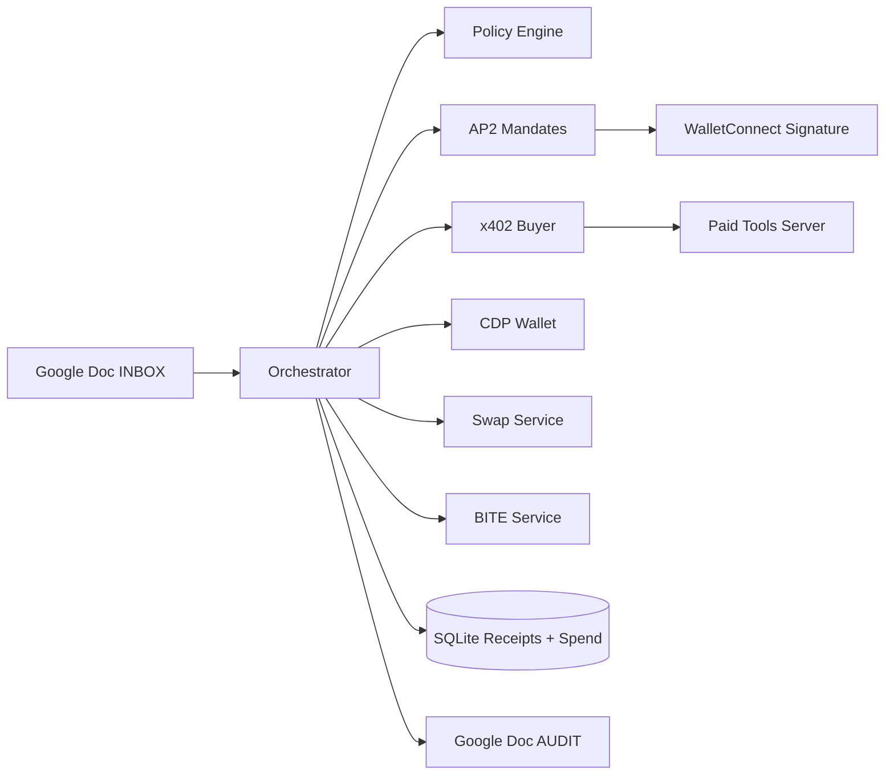

# Zoro

Zoro turns a Google Doc into an agentic commerce control panel:

- User writes intent in the doc.
- Agent parses, applies policy, and requests approval.
- Agent pays for x402 tools, executes settlement/swap/encrypted flow.
- Agent writes receipts and outcome back to the same doc.

## Implementation Status

| Component | Status | Notes |
|---|---|---|
| Google Doc ingest + audit writeback | Implemented | INBOX read, AUDIT receipts |
| Natural language command parsing | Implemented | LLM + deterministic fallback |
| AP2 intent/cart/payment mandates | Implemented | Typed-data signature verification |
| WalletConnect approval | Implemented | Server-initiated signature flow |
| x402 buyer flow | Implemented | Official `@x402/fetch` + CDP signer |
| x402 seller middleware | Implemented | Official `@x402/hono` |
| Paid tool chaining (>=2 steps) | Implemented | `vendor-risk` + `compliance-check` |
| Spend ledger | Implemented | Per tool call, per command |
| PAY_VENDOR settlement | Implemented | CDP transfer + tx confirmation lookup |
| TREASURY_SWAP DeFi action | Implemented | CDP swap + paid pre-swap research |
| BITE encrypted lifecycle | Implemented | Encrypt -> condition -> submit -> decrypt |

## Architecture



## Hackathon Flow Mapping

### 1. x402 Track

- Uses CDP wallet signer for x402 exact scheme.
- Handles `402 -> pay -> retry` per tool call.
- Chains multiple paid tools in a single command.
- Tracks spend and stores receipts.

### 2. AP2 Track

- Creates intent mandate at ingestion.
- Requests typed-data signature via WalletConnect.
- Verifies signer before execution.
- Persists mandates + receipts for auditability.

### 3. DeFi Track

- Runs pre-trade paid `price-check` tool.
- Enforces slippage and spend controls.
- Executes on-chain swap and stores tx receipt.

### 4. Encrypted Agents Track

- Creates encrypted transfer job.
- Enforces time-based unlock condition.
- Submits encrypted tx and fetches decrypted data.

## Environment Variables

### Core

- `STRICT_LIVE_MODE` (`1` live, `0` simulated)
- `PORT`
- `TOOLS_PORT`
- `TOOLS_BASE_URL` (optional)
- `DB_PATH`
- `X402_CHAIN` (default: `base-sepolia`)

### Google

- `GOOGLE_DOC_ID`
- `GOOGLE_SERVICE_ACCOUNT_JSON`

### WalletConnect / AP2

- `WC_PROJECT_ID`
- `WC_RELAY_URL`
- `AP2_CHAIN_ID`

### CDP / Settlement

- `CDP_API_KEY_ID` or `CDP_API_KEY_NAME`
- `CDP_API_KEY_SECRET` or `CDP_API_KEY_PRIVATE_KEY`
- `CDP_WALLET_SECRET`
- `X402_BUYER_ACCOUNT_NAME`
- `BASE_RPC_URL`
- `BASE_USDC_ADDRESS`
- `WETH_ADDRESS`

### x402 Policy

- `X402_MAX_PER_CMD_USDC`
- `X402_DAILY_LIMIT_USDC`
- `X402_REQUIRE_APPROVAL_ABOVE_USDC`
- `AUTO_RUN_UNDER_USDC`
- `X402_TOOL_ALLOWLIST` (default: `vendor-risk,compliance-check,price-check`)

### SKALE / BITE

- `SKALE_ENABLED`
- `SKALE_RPC_URL`
- `SKALE_CHAIN_ID`
- `SKALE_USDC_ADDRESS`
- `EXECUTOR_PRIVATE_KEY`

## API Endpoints

- `POST /api/tick/:docId`
- `POST /api/ap2/cmd/:docId/:cmdId/request-approval`
- `GET /api/commands/:docId/:cmdId/trace`
- `GET /api/spend-summary/:docId/:cmdId`
- `GET /.well-known/tools`
- `POST /tools/vendor-risk` (paid)
- `POST /tools/compliance-check` (paid)
- `POST /tools/price-check` (paid)

## Run

```bash
npm install
npm test
npm run build
npm run dev
```

## Demo Checklist

1. `PAY_VENDOR`: show AP2 approval, two paid x402 calls, settlement tx, spend summary.
2. `TREASURY_SWAP`: show paid `price-check`, swap tx hash, slippage controls.
3. `PRIVATE_PAYOUT`: show encrypted job creation, unlock, submit, decrypt evidence.

## Commands

- `Pay ACME 200 USDC to 0x1111111111111111111111111111111111111111 tool budget 1 total cap 2`
- `Swap 25 USDC to WETH slippage 50 max spend 30`
- `Private payout 50 USDC to 0x2222222222222222222222222222222222222222 at 2026-02-13T12:00:00Z`

